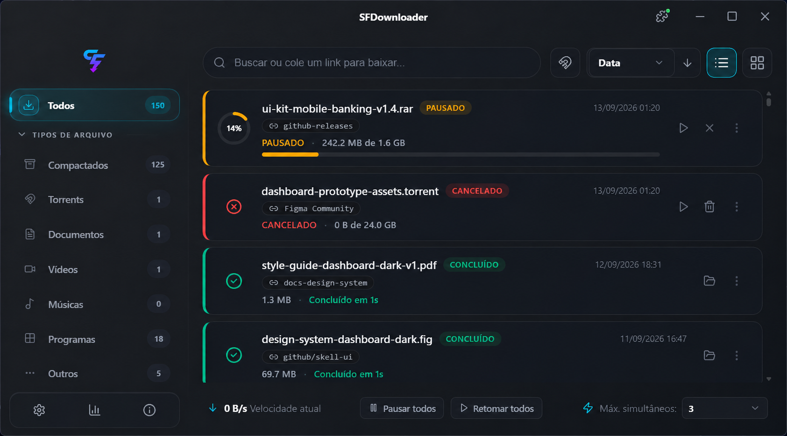
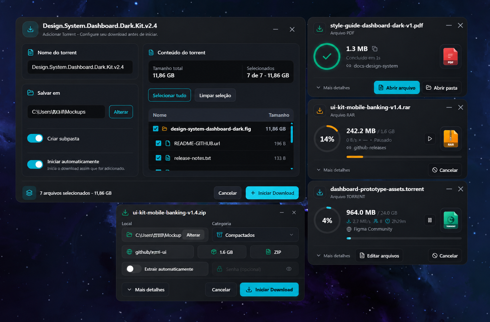
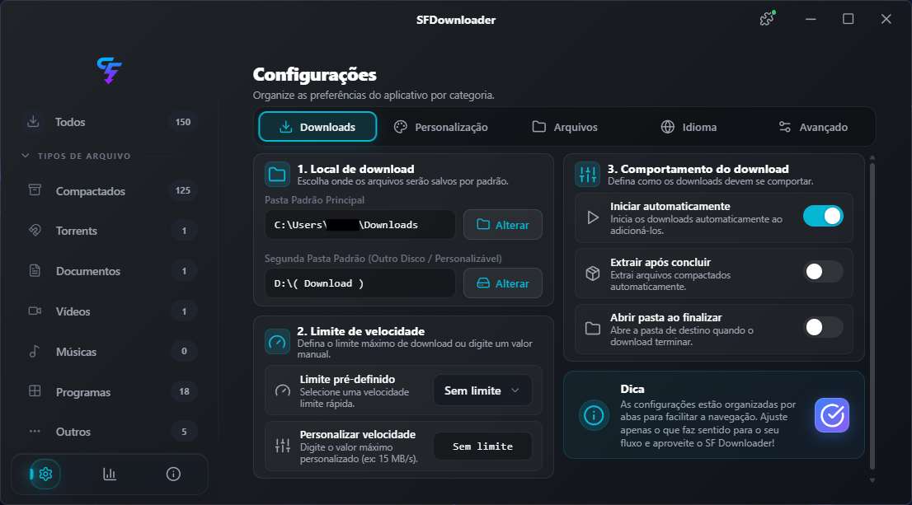
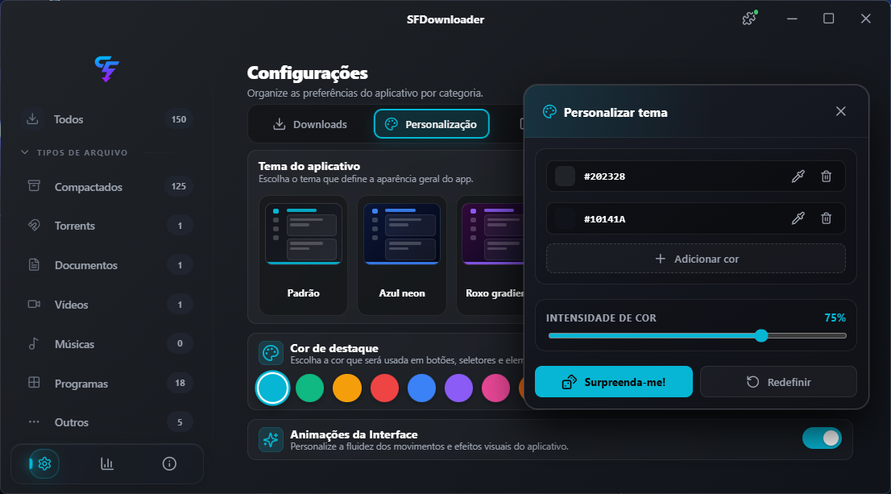
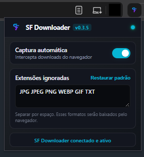
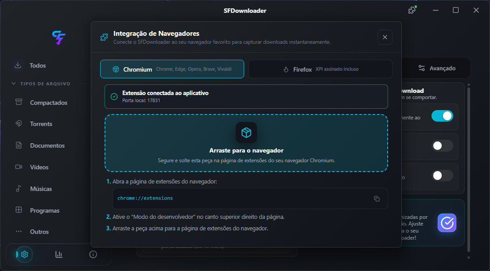

<div align="center">

# SFDownloader

**Gerenciador de downloads para Windows, feito com Tauri, React e Rust.**

[](https://github.com/NskBR/SFDownloader-App/releases)
[](https://tauri.app)
[](https://react.dev)

[Baixar](https://github.com/NskBR/SFDownloader-App/releases) · [Reportar problema](https://github.com/NskBR/SFDownloader-App/issues) · [Changelog](CHANGELOG.md) · [Plano técnico](docs/MASTER_PLAN.md)

</div>

> [!IMPORTANT]
> **Versão atual: 1.0.3.** O SFDownloader está em beta privada para **Windows 10/11 64 bits**. Recursos HTTP estão prontos para uso cotidiano; o motor BitTorrent/P2P segue em estabilização e deve ser usado com validação do arquivo final.

## O aplicativo

O SFDownloader reúne downloads HTTP/HTTPS e BitTorrent em uma interface desktop nativa. Ele organiza arquivos por categoria, permite pausar e retomar tarefas, mantém uma fila persistente, extrai arquivos compactados e captura downloads pelo navegador através de uma ponte local protegida.



## Progresso atual

O progresso representa entrega funcional, cobertura de fluxos e estabilização. Não é uma garantia de que todos os cenários de rede, navegadores ou torrents já foram testados em campo.

| Área | Progresso | Estado atual |
| --- | ---: | --- |
| Downloads HTTP/HTTPS | **100%** | Segmentação, pausa, retomada, validação de origem, fila, prioridade, limites e agendamento. |
| Organização e extração | **95%** | Categorias, destinos, ZIP, RAR, 7Z e TAR; testes manuais adicionais de links/reparse points no Windows ainda pendentes. |
| Interface, temas e acessibilidade | **85%** | Temas, gradientes, escala, idiomas e janelas próprias prontos; revisão visual contínua para telas e textos extremos. |
| Integração com navegadores | **95%** | Chromium e Firefox, captura de links, cookies/headers temporários e fallback por deep link; faltam cenários reais com blobs e páginas autenticadas. |
| Métricas e diagnóstico | **100%** | Métricas persistentes, exportação e logs sanitizados. |
| Segurança e privacidade | **90%** | CSP, permissões por janela, ponte local autenticada, validação de caminhos e limpeza de credenciais; faltam testes manuais de reparse points no Windows. |
| Motor BitTorrent/P2P | **90%** | Funcional para uso beta, com matriz real de interoperabilidade ainda incompleta. |
| Release e documentação | **75%** | Build local e versionamento prontos; licença, assinatura de código e validação final de distribuição ainda pendentes. |

### Progresso geral: **89%**

O próximo marco é concluir a validação manual de rede, torrent e extensões em versões atuais de Windows e navegadores, antes de tratar o aplicativo como release pública estável.

## Recursos

- Downloads HTTP/HTTPS segmentados, com pausa, retomada e recuperação após reinicialização.
- Verificação de ETag e Last-Modified antes de retomar um arquivo que pode ter mudado no servidor.
- Fila persistente, prioridades, limite de velocidade e janela diária de download.
- Destinos configuráveis, categorias automáticas e organização de arquivos.
- Extração opcional de ZIP, RAR, 7Z e TAR, inclusive arquivos protegidos por senha.
- Janela de confirmação com nome, tamanho, destino e metadados antes de iniciar.
- Métricas de downloads, exportação técnica e logs de diagnóstico sem credenciais.
- Temas, cores de destaque, gradientes, escala de interface e Português (Brasil)/Inglês.
- Integração com Chrome, Edge, Brave, Opera, Vivaldi e Firefox.
- Atualização manual via GitHub Releases, sempre exigindo confirmação do usuário para abrir o instalador.

## BitTorrent/P2P — estado do motor

O motor usa `librqbit` e aceita arquivos `.torrent` e magnet links. O fluxo atual permite obter metadados, escolher arquivos antes de iniciar, editar a seleção durante o download, pausar, retomar, cancelar mantendo ou apagando dados locais e reaproveitar arquivos existentes ao adicionar o mesmo torrent no mesmo destino. A aplicação persiste o estado e verifica peças locais ao restaurar a tarefa.

| Disponível nesta beta | Ainda em validação |
| --- | --- |
| `.torrent` e magnet links | Swarms reais de torrents v2 e híbridos |
| Seleção parcial e edição posterior de arquivos | Trackers HTTP, HTTPS e UDP em matriz completa |
| Pausa, retomada e recuperação de sessão | Torrents sem tracker quando DHT for o único caminho |
| Verificação de arquivos locais e retomada por peças válidas | Reinício durante verificação, nomes Unicode e caminhos longos em testes de campo |
| Estatísticas de transferência e peers ativos | Contagem confiável de seeds: a API pública atual não fornece esse dado |

Após concluir o arquivo, a beta pausa o handle e **não mantém seeding**. Para dados importantes, confirme o hash ou abra o arquivo final; quando houver uma fonte HTTP/HTTPS confiável, ela continua sendo a opção recomendada.



## Interface e personalização

Configurações organizam o destino padrão, o comportamento da fila, limites, categorias, idiomas e preferências visuais.

| Downloads e comportamento | Tema e cores |
| --- | --- |
|  |  |

## Integração com navegador

A extensão oferece captura de downloads diretamente no navegador. Ela se comunica somente com o processo local do SFDownloader, em `127.0.0.1:17831`, usando um token aleatório renovado a cada execução.

| Extensão | Configuração no aplicativo |
| --- | --- |
|  |  |

Para instalar, abra **Configurações → Integração com navegador**:

1. Em navegadores Chromium, arraste o pacote exibido pelo app até `chrome://extensions` ou `edge://extensions` com o Modo do desenvolvedor ligado.
2. No Firefox, use o XPI assinado disponibilizado na própria tela de integração e confirme a instalação.
3. Se o status estiver desconectado, confirme que o SFDownloader está aberto e recarregue a extensão.

## Instalação e atualização

1. Abra [Releases](https://github.com/NskBR/SFDownloader-App/releases) e baixe o instalador Windows `.exe`.
2. Execute o instalador e siga as etapas do Windows.
3. Quando a titlebar indicar uma atualização, escolha baixar a nova versão.
4. Ao terminar, escolha quando abrir o instalador. O aplicativo não instala atualizações silenciosamente.

O aplicativo ainda não possui assinatura de código pública. Verifique que o instalador veio do repositório oficial antes de ignorar qualquer alerta do Windows SmartScreen.

## Segurança e privacidade

Esta revisão não encontrou chaves privadas, tokens de produção, arquivos `.env`, certificados, instaladores locais ou artefatos de build rastreados pelo Git, inclusive no histórico acessível do repositório. A pasta `release/`, `dist/`, `target/` e `node_modules/` permanece ignorada.

- A ponte do navegador fica restrita ao loopback e exige token por processo, origem de extensão permitida e limites de payload.
- URLs, cookies, tokens e headers sensíveis são removidos dos logs e diagnósticos exportados.
- Caminhos recebidos pela interface são validados antes de operações de abertura, extração e remoção.
- A CSP do WebView bloqueia conteúdo remoto não autorizado.
- O atualizador aceita apenas instaladores de releases oficiais e pede ação explícita antes de executá-los.

O principal risco residual é inerente à extensão: uma extensão maliciosa que já tenha permissões concedidas pelo usuário pode tentar solicitar capturas locais. Revise extensões instaladas e permissões do navegador. Consulte o [modelo de ameaças](docs/THREAT_MODEL.md), a [política de privacidade da extensão](browser-extension/PRIVACY.md) e a [auditoria de dependências](docs/DEPENDENCY_AUDIT.md).

## Desenvolvimento

### Pré-requisitos

- Node.js 20+ e npm
- Rust estável via [rustup](https://rustup.rs/)
- Dependências do [Tauri 2 para Windows](https://v2.tauri.app/start/prerequisites/)

```bash
npm ci
npm run tauri dev
```

### Validação

```bash
npm test -- --run
npm run build
npm run versions:check
npm run extension:lint
npm run extension:test
npm run extension:build
```

Para o backend no Windows:

```powershell
.\scripts\test-backend.ps1
```

### Build local de release

```bash
npm run release
```

Os instaladores gerados são movidos para `release/`, uma pasta local ignorada pelo Git. A distribuição é feita manualmente; o repositório não publica builds por GitHub Actions.

## Estrutura

```text
src/                 Interface React e TypeScript
src-tauri/           Aplicativo Tauri e motor Rust
browser-extension/   Extensões Chromium e Firefox
docs/                Planejamento, segurança, auditorias e imagens do README
scripts/             Versionamento, build local e testes
release/             Instaladores locais, ignorados pelo Git
```

## Contribuição

Use as [Issues](https://github.com/NskBR/SFDownloader-App/issues) para relatar bugs. Inclua versão, passos para reproduzir, comportamento esperado e logs já sanitizados quando houver. O [plano mestre](docs/MASTER_PLAN.md) detalha as pendências técnicas e os critérios de estabilização.
